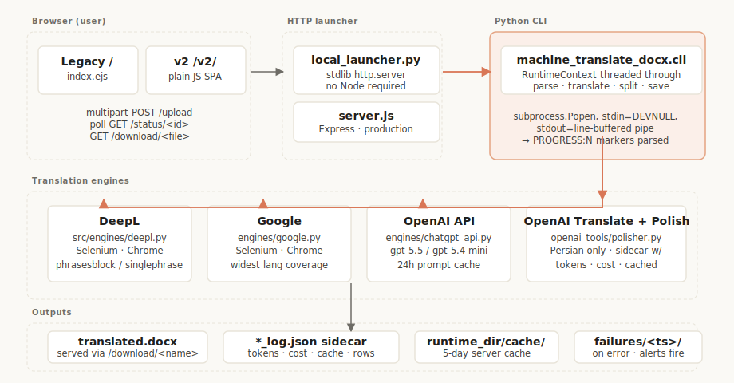
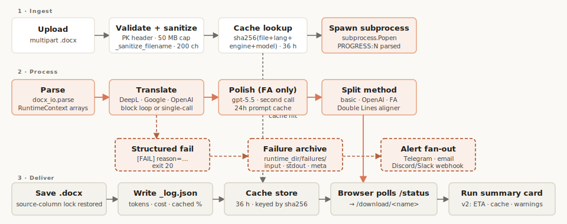
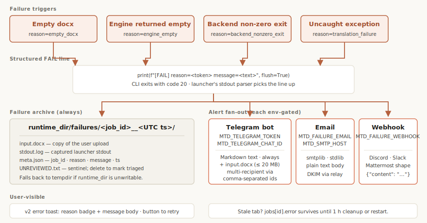

<h1 align="center">machine-translate-docx</h1>

<p align="center">
  Translate Word (<code>.docx</code>) documents through DeepL, Google,
  or OpenAI — with a Persian polish pass tuned for broadcast subtitles.
</p>

<p align="center">
  
  
  
  
  
</p>

<p align="center">
  <a href="#quick-start">Quick start</a> ·
  <a href="#architecture">Architecture</a> ·
  <a href="#documentation">Documentation</a> ·
  <a href="CONTRIBUTING.md">Contributing</a> ·
  <a href="CHANGELOG.md">Changelog</a>
</p>

---

<picture>
  <source media="(prefers-color-scheme: dark)" srcset="docs/diagrams/architecture-dark.svg">
  
</picture>

## What it does

Drop a Word file on the page, pick a target language and engine,
get the translated docx back. Four engines are wired in: **DeepL**
and **Google** drive headless Chrome over Selenium; **OpenAI API**
runs a single-call translation against `gpt-5.5` (or `gpt-5.4-mini`);
**OpenAI + Polish** adds a Persian-only post-pass that produces a
broadcast-quality subtitle file plus an optional bilingual
double-line output for TV.

The project is intentionally **dependency-light**:

- The dev server is a single `local_launcher.py` (stdlib only — no
  Node required).
- The v2 SPA at `/v2/` is plain JS — no React, no Vue, no Alpine.
- The legacy UI at `/` is an unchanged EJS template, kept side-by-
  side so existing users see no behaviour change.

Tested live on every engine across `en→fr`, `en→de`, `en→es`,
and `en→fa`. The 24-hour OpenAI prompt cache trims subsequent
re-runs to ~$0.018 on the standard fixture (~92% cache hit on
translation, ~76% on polish).

## Quick start

```bash
# Python 3.11+
git clone https://github.com/Milomilo777/machine-translate-docx.git
cd machine-translate-docx

pip install -r compile/requirements.txt
pip install -r requirements-test.txt

# Run the unit tests (113 should pass)
python -m pytest tests/ --ignore=tests/test_v2_e2e.py

# Start the dev server (no Node required)
python local_launcher.py
```

Then open:

- **`http://127.0.0.1:3000/`** — legacy UI (EJS template, unchanged).
- **`http://127.0.0.1:3000/v2/`** — modern SPA (plain JS, Anthropic
  warm palette, auto RTL for Persian/Arabic/Hebrew/Urdu).

Both frontends share the same backend.

For one-shot CLI use:

```bash
PYTHONPATH=src python -m machine_translate_docx.cli \
    --docxfile your_file.docx \
    --srclang en --destlang fa \
    --engine chatgpt --enginemethod api \
    --aimodel gpt-5.4-mini --with-polish \
    --silent --exitonsuccess
```

## Translation pipeline

<picture>
  <source media="(prefers-color-scheme: dark)" srcset="docs/diagrams/pipeline-dark.svg">
  
</picture>

Every chatgpt-polish run leaves a `*_log.json` sidecar next to the
output docx with model id, per-block token counts, cached-token
counts, and cost in USD. DeepL / Google runs leave a minimal sidecar
(no tokens / no cost — engine doesn't expose them) carrying engine
name, language pair, and row counts.

The v2 SPA surfaces all of this as a **Run summary card** after every
job: model, elapsed time, tokens, cache-hit %, cache savings, cache
expiry countdown, rows translated, polish lines touched. Three soft
**quality warnings** flag polish over-rewrite, suspiciously short
output, or unexpected cache misses. The whole panel is toggleable
via a small Display Preferences modal.

## Failure handling

<picture>
  <source media="(prefers-color-scheme: dark)" srcset="docs/diagrams/failure-path-dark.svg">
  
</picture>

When a job fails, the launcher always writes a copy of the input
docx + captured stdout + a `meta.json` to
`runtime_dir/failures/<job_id>__<UTC ts>/` for offline triage.
Three optional alert channels ride on top — every channel is opt-in
behind an env var:

| Channel | Env vars | Notes |
|---|---|---|
| **Telegram bot** | `MTD_TELEGRAM_TOKEN`, `MTD_TELEGRAM_CHAT_ID` (comma-separated for multi-recipient) | Free forever. Text alert + optional ≤ 20 MB docx attachment. Full setup in [`docs/telegram-alerts-setup.md`](docs/telegram-alerts-setup.md). |
| **Email** | `MTD_FAILURE_EMAIL`, `MTD_SMTP_HOST`, etc. | `smtplib` (stdlib). Use Brevo / SendGrid for delivery in production. |
| **Webhook** | `MTD_FAILURE_WEBHOOK` | Discord / Slack / Mattermost incoming-webhook shape. |

Alert sends are best-effort: a flaky network or revoked token never
blocks the failure-archive path.

## Architecture

```
src/
├── machine_translate_docx.py    CLI entry — orchestrator
├── runtime.py                   RuntimeContext (replaces ~80 module globals)
├── config.py                    DEFAULT_AI_MODEL, VALID_AI_MODELS, lang tables
├── runner.py                    Block-loop dispatcher
├── dispatch.py                  set_translation_function(ctx)
├── exceptions.py                TranslationFailure hierarchy
├── translation_health.py        assert_source_has_content / assert_translation_present
├── docx_io/                     parse, cells, runs, save (everything docx-shaped)
├── engines/
│   ├── chatgpt_api.py           single-call OpenAI translation
│   ├── deepl.py                 Selenium-driven DeepL
│   ├── google.py                Selenium-driven Google
│   └── inactive/                disabled engines kept for reference
├── openai_tools/
│   ├── translator.py            translate
│   ├── polisher.py              Persian polish pass
│   ├── splitting.py             legacy line splitter
│   ├── persian_double_lines.py  FA bilingual aligner
│   ├── fa_postprocess.py        safe FA character normaliser (3 mappings)
│   └── line_count_reconciler.py recover after engine line drift
└── selenium_utils/              driver / click / forms helpers

web/v2/                          v2 SPA (HTML + plain JS + handwritten CSS)
└── content.json                 announcements + stories (single source of truth)

prompts/                         system prompts (translate_PER.txt, polish_PER.txt, …)

local_launcher.py                Python stdlib HTTP server (dev)
server.js                        Express server (production)
index.ejs                        Legacy UI template (preserved)
```

The `RuntimeContext` (`src/runtime.py`) is the central refactor work
of this project: ~80 module-level globals from the original script
were grouped into seven dataclasses (`flags`, `language`, `engine`,
`openai`, `docx`, `browser`, `config`) and threaded as `ctx` through
every pipeline function. A `_sync_globals_from_ctx` bridge keeps a
handful of legacy helpers working until they're fully threaded.

## Documentation

Deeper docs live in [`docs/`](docs/) — there are 20+ markdown files
covering different angles. Start with these:

| Topic | File |
|---|---|
| Full architecture + data flow | [`docs/architecture.md`](docs/architecture.md) |
| Translation style guide (Persian broadcast) | [`docs/translation-style.md`](docs/translation-style.md) |
| Aligner algorithm + thresholds | [`docs/subtitle-syncing.md`](docs/subtitle-syncing.md) |
| Telegram alerts setup + security | [`docs/telegram-alerts-setup.md`](docs/telegram-alerts-setup.md) |
| Testing playbook | [`docs/testing.md`](docs/testing.md) |
| Known bugs / catalogue | [`docs/error-catalog.md`](docs/error-catalog.md) |
| Decision log (2026) | [`docs/decisions-2026.md`](docs/decisions-2026.md) |
| Architecture diagrams | [`docs/diagrams/README.md`](docs/diagrams/README.md) |

The project's hard invariants (`C1` through `C20`) live in
[`PROJECT_MEMORY.md`](PROJECT_MEMORY.md) — read them before sending
a PR that touches the pipeline.

## Status

- **Unit tests**: 113 / 113 passing (`make test`).
- **Smoke test**: DeepL en→fr on the canonical fixture in 27 s,
  0 / 42 source-column mismatches (`make smoke`).
- **Live validation**: re-run weekly across DeepL, Google, and
  OpenAI (with + without polish). Last pass: 2026-05-11.
- **24-h prompt cache**: 92 % hit on translation, 76 % on polish
  in the second run of the same document.
- **Weekly newsletter export**: every Saturday at 12:00
  Europe/Paris the launcher uploads `subscribers.txt` as a
  Telegram document (env-gated; see
  [`docs/telegram-alerts-setup.md`](docs/telegram-alerts-setup.md)).

## Acknowledgements

This project sits on top of:

- [python-docx](https://python-docx.readthedocs.io/) for parsing.
- [Selenium](https://www.selenium.dev/) and [undetected-chromedriver](https://github.com/ultrafunkamsterdam/undetected-chromedriver) for the headless-browser engines.
- [OpenAI Python SDK](https://github.com/openai/openai-python) for the API engines.
- [DeepL](https://www.deepl.com/) and [Google Translate](https://translate.google.com/) for translation.
- Anthropic's [Claude](https://www.anthropic.com/claude) for the v2 UI palette inspiration and the audit / refactor work in 2026.

## License

[MIT](LICENSE).
