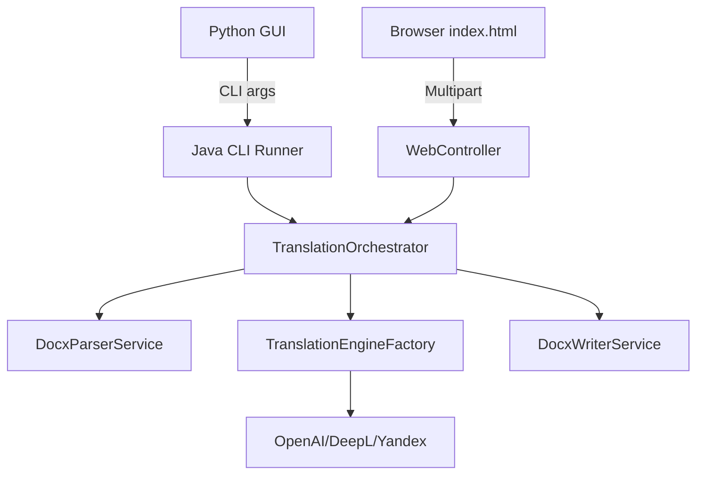

# Enterprise SMTV Translation Engine

## Dual Architecture
This system operates symmetrically via two primary entry points:
1. **Headless CLI Backend:** Acts as the high-performance sub-process for the legacy Python GUI, parsing strict `args[]` arrays.
2. **Standalone Web Server:** Exposes a Spring Boot `WebController` handling multipart uploads from a modern `index.ejs` static frontend.

## Architecture Diagram


## Quick Start
```bash
# Build the executable Fat JAR (skipping tests for speed)
mvn clean package -DskipTests

# Run the CLI Tool
java -jar target/translation-robot.jar <path_to_docx> <target_language_code> <engine_name>

# OR start the Web Server
start javaw -jar target/translation-robot.jar
# Then open http://localhost:8080
```