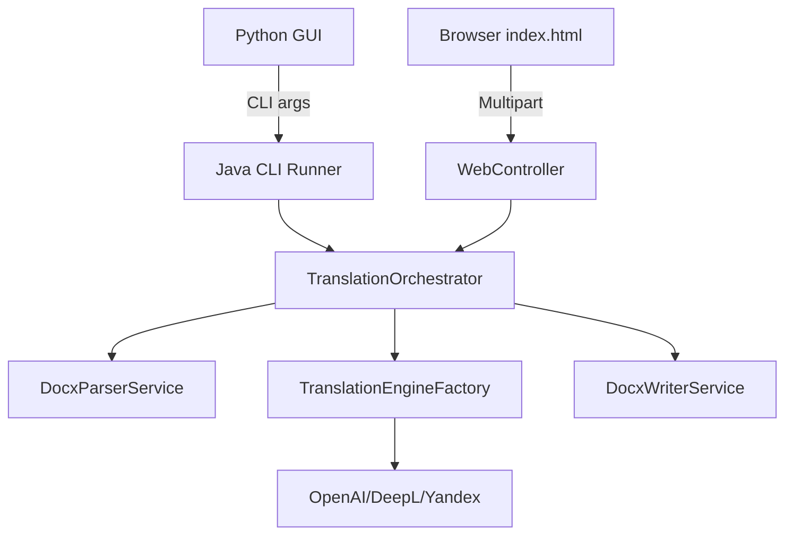

# Enterprise SMTV Translation Engine

## Database-Safe Architecture & Dual Entry
This system operates via a decoupled, resilient architecture specifically designed to handle massive multi-page DOCX documents and deeply nested technical/spiritual queries without risking rollback/overflow:
- **Non-blocking Logging:** Database operations (saving translation metrics and query structures) are completely asynchronous and isolated. If a metric fails to write due to long file paths (e.g. Windows Temp paths on Dell Vostros), it does not halt the underlying DOCX translation process.
- **Dual Architecture:**
This system operates symmetrically via two primary entry points:
1. **Headless CLI Backend:** Acts as the high-performance sub-process for the legacy Python GUI, parsing strict `args[]` arrays.
2. **Standalone Web Server:** Exposes a Spring Boot `WebController` handling multipart uploads from a modern `index.ejs` static frontend.

## Architecture Diagram


## Quick Start (Dell Vostro 3590 Environment)
Due to standard Windows environments mapping temporary files to highly nested `C:\Users\...\AppData\Local\Temp` directories, the backend uses a resilient schema.

```bash
# Build the executable Fat JAR natively on Windows (skip tests for speed)
mvn clean package -DskipTests

# Run the CLI Tool
java -jar target\translation-robot.jar <path_to_docx> <target_language_code> <engine_name>

# OR start the Web Server silently
start javaw -jar target\translation-robot.jar
# Then open http://localhost:8080
```

## Authentication & Engine Configuration
The engine has been architecturally designed to support free and community-driven endpoints.
- **ChatGPT (API)**: Reads `OPENAI_API_KEY` directly from the OS Windows Environment Variables (Priority 1).
  - **Emergency Hardcoding:** If you cannot set Environment Variables, you can open `src/main/resources/application.properties` and add your key like so: `openai.api.key=sk-proj-YOUR_KEY_HERE`. The application applies a "Triple-Lock" cleanup to remove accidental quotes or duplicate `Bearer` prefixes.
- **Google / DeepL**: Refactored to use unofficial free web APIs via web-scraping-style raw HTTP requests, meaning official API keys are no longer required to translate documents using these engines.