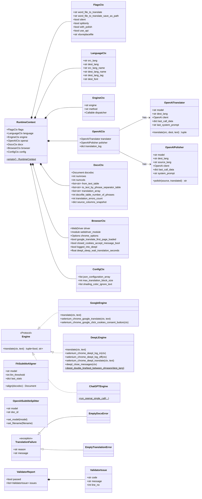
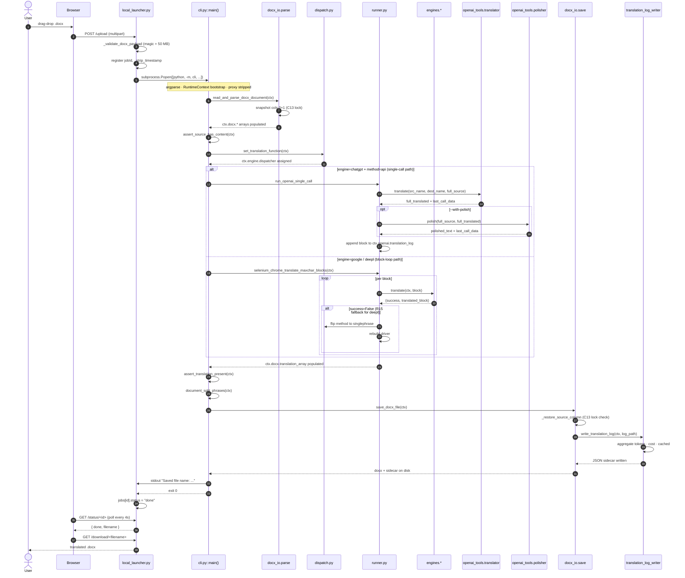
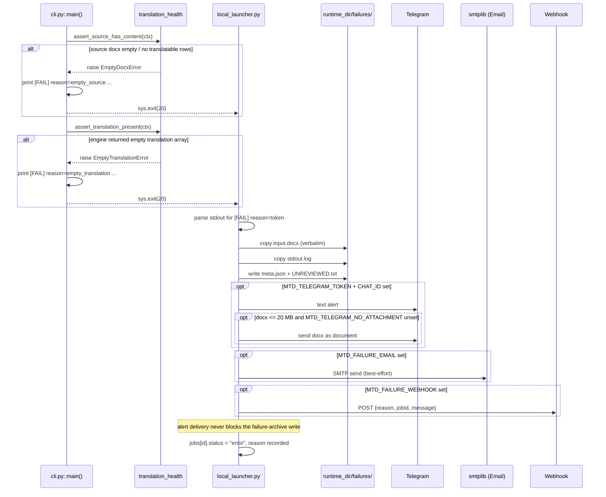
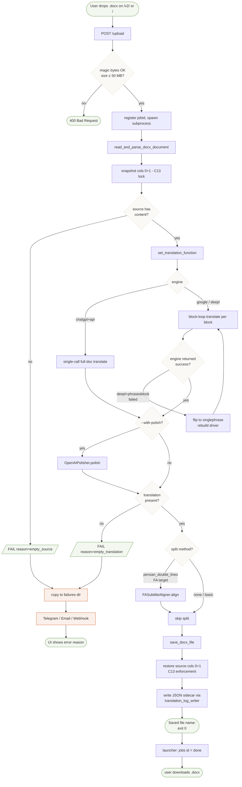
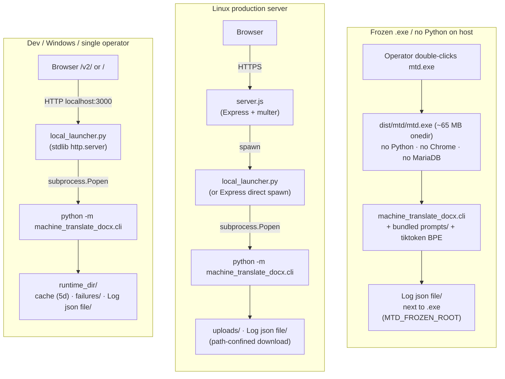

# UML — machine-translate-docx

> Five Mermaid-based UML diagrams covering the architecturally relevant
> facets of the project. Render natively in GitHub or any Mermaid-aware
> viewer (VS Code Mermaid extension, mermaid.live, GitHub web UI). This
> file is the companion to:
>
> - [`architecture.md`](architecture.md) — prose component breakdown.
> - [`diagrams/architecture-light.svg`](diagrams/architecture-light.svg) — high-level SVG.
> - [`diagrams/architecture-detailed-light.svg`](diagrams/architecture-detailed-light.svg) — full module-level SVG.

## Reflection — what UML buys us, and where it doesn't

Not everything in this project benefits from UML. Persian pipeline,
Selenium engines, and the OpenAI client wrappers are mostly functional
code; class diagrams of them would be padding. Where UML genuinely
helps:

| Aspect | Useful UML | Why |
|---|---|---|
| `RuntimeContext` composition | Class | 7 dataclasses, one root; a single picture beats 600 lines of reading. |
| Engine pluggability | Class | Protocol + 3 implementations is textbook OO. |
| Main pipeline | Sequence | 6 actors talk to each other; reading the call graph from code takes longer than glancing at the diagram. |
| Failure path | Sequence | 3 alert channels + archive + structured `[FAIL]` line, all conditional. |
| Job lifecycle decisions | Activity | Engine branch, polish gate, split branch, C13 lock — captured as a single flow chart. |
| Deployment topology | Deployment | Three surfaces (dev / prod / frozen `.exe`) differ in non-obvious ways. |

What is intentionally absent:
- **Use-case diagram** — one use case (translate a docx); the diagram
  would have one ellipse.
- **State diagram of an engine** — the only real state transition is
  the R15 DeepL `phrasesblock → singlephrase` fallback, which is
  captured in the activity diagram below.
- **Class diagram of every `openai_tools/*` class** — they are loosely
  coupled API wrappers without inheritance worth drawing.

---

## 1 — Class diagram

`RuntimeContext` composition + Engine protocol + OpenAI tool surface +
Validators + Exceptions. Methods are abbreviated where the body is
incidental.

Reading guide:
- `*--` (composition) = the parent owns the child's lifetime
  (RuntimeContext owns its sub-contexts; ValidatorReport owns its issues).
- `<|..` (interface realization) = the class implements the Protocol.
- `<|--` (inheritance) = exception hierarchy.

---

## 2 — Sequence diagram (happy path)

End-to-end translation, OpenAI `chatgpt --enginemethod api --with-polish`
shown as the main branch with `alt` blocks for the other engines.

---

## 3 — Sequence diagram (failure + alerting)

What happens when the pipeline fails. Captures B-001 (structured
failure exit), B-002 (failure archive), and the three alert channels.

---

## 4 — Activity diagram (job lifecycle)

The full decision tree from upload to download, including every branch
point. Square boxes are actions; diamonds are decisions; double-ended
boxes are terminal states.

---

## 5 — Deployment diagram

Three production surfaces with different bill-of-materials. The CLI is
the same; the wrapper changes.

Key differences between the three surfaces:

| Aspect | Dev | Prod | Frozen .exe |
|---|---|---|---|
| HTTP shell | `local_launcher.py` | `server.js` + Express | (none — CLI direct) |
| Path-traversal check | yes | yes (P0-1 fix, 2026-05-16) | n/a |
| Chrome required | yes (Google / DeepL) | yes | only if engine is not chatgpt+api |
| OpenAI API key | env var | env var (subprocess only) | env var or runtime prompt |
| Cache location | `runtime_dir/cache/` | `uploads/` + cache | `Log json file/` only |
| Failure alerts | yes | yes | yes (if env vars set) |
| Telemetry | local stdout | server log + alerts | local stdout |

---

## Maintenance

Update this file when:
- a new sub-context is added to `RuntimeContext` → bump section 1
- a new engine joins `engines/` → bump sections 1 + 4
- a new failure path lands → bump section 3
- a new deployment surface ships → bump section 5

Last refreshed: 2026-05-16 (after the cli.py 3-phase shrink + Sprint A/B/C audit follow-up).
